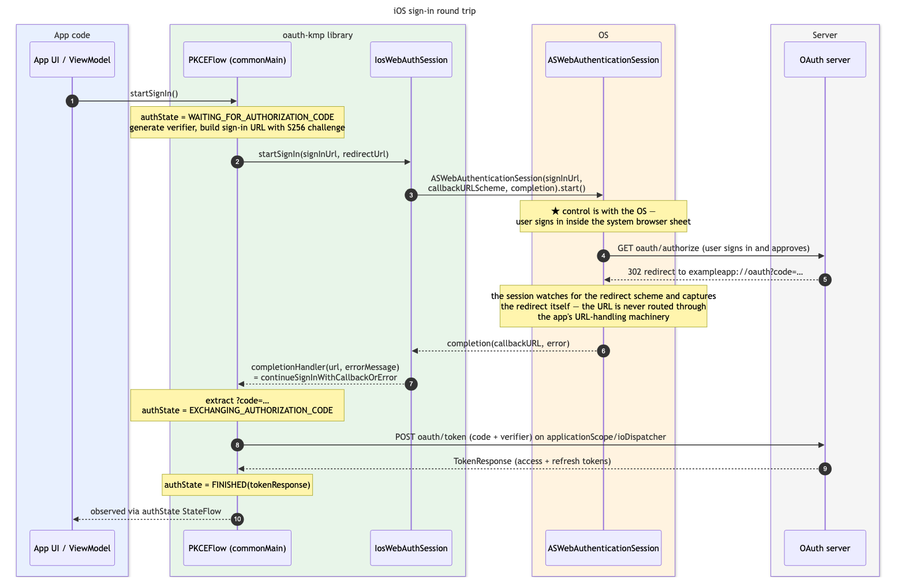
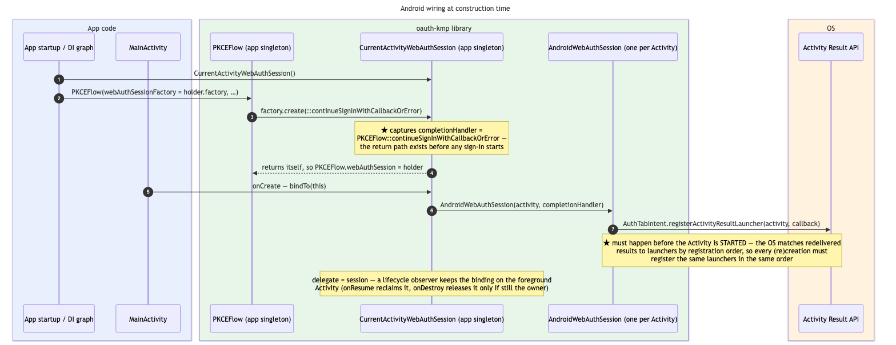
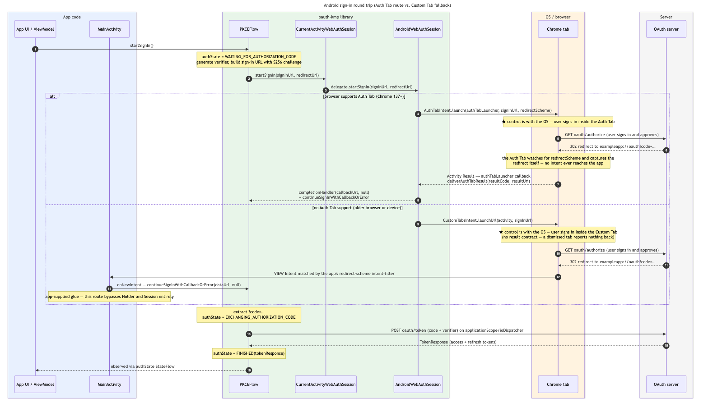

# Architecture

This document explains how a sign-in actually travels through the library at runtime: which
objects exist and for how long, how the completion callback gets wired up, where control leaves
the app for the OS, and how the OAuth redirect finds its way back. The [README](README.md) covers
how to *integrate* the library; this covers how it *works inside* — mostly for Android's benefit,
where the answer depends on which of two return routes the installed browser supports. (iOS, by
contrast, is a single API with a closure.)

## The pieces

| Source set | Type | Role |
| --- | --- | --- |
| `commonMain` | [`PKCEFlow`](oauth-core/src/commonMain/kotlin/com/collectiveidea/oauth/PKCEFlow.kt) | The orchestrator. Builds the sign-in URL, receives the callback URL, exchanges the authorization code for tokens, and publishes progress as `authState: StateFlow<PKCEAuthState>`. One app-lifetime instance. |
| `commonMain` | [`WebAuthSession`](oauth-core/src/commonMain/kotlin/com/collectiveidea/oauth/WebAuthSession.kt) | The platform seam: the `WebAuthSession` interface (`startSignIn(signInUrl, redirectUrl)`), the `WebAuthSessionCompletionHandler` typealias (`(callbackUrl?, errorMessage?) -> Unit`), and the `WebAuthSessionFactory` that `PKCEFlow` uses to build its session. |
| `commonMain` | [`PKCEUtil`](oauth-core/src/commonMain/kotlin/com/collectiveidea/oauth/PKCEUtil.kt) | [RFC 7636](https://datatracker.ietf.org/doc/html/rfc7636) helpers: a CSPRNG code verifier and its S256 code challenge (URL-safe base64, no padding). |
| `commonMain` | [`OAuthService`](oauth-core/src/commonMain/kotlin/com/collectiveidea/oauth/OAuthService.kt) / [`OAuthServiceImpl`](oauth-core/src/commonMain/kotlin/com/collectiveidea/oauth/OAuthServiceImpl.kt) | The two token-endpoint calls, both `POST oauth/token`: `exchangeAuthorizationCode` (used by `PKCEFlow`) and `refreshTokens` (called by the app later, outside any sign-in). |
| `commonMain` | [`installJsonOAuth`](oauth-core/src/commonMain/kotlin/com/collectiveidea/oauth/HttpClientJsonOauthHelper.kt) | Ktor client setup: base URL, JSON content negotiation, and mapping error responses into `OAuthException`/`OAuthError`. |
| `androidMain` | [`AndroidWebAuthSession`](oauth-core/src/androidMain/kotlin/com/collectiveidea/oauth/AndroidWebAuthSession.kt) | Per-`Activity` session. Opens a Chrome [Auth Tab](https://developer.chrome.com/docs/android/custom-tabs/guide-auth-tab) when the browser supports one, else falls back to a Custom Tab; registers the Auth Tab result launcher at construction. |
| `androidMain` | [`CurrentActivityWebAuthSession`](oauth-core/src/androidMain/kotlin/com/collectiveidea/oauth/CurrentActivityWebAuthSession.kt) | App-scoped holder that bridges the singleton `PKCEFlow` to whichever `Activity`'s `AndroidWebAuthSession` is current. |
| `iosMain` | [`IosWebAuthSession`](oauth-core/src/iosMain/kotlin/com/collectiveidea/oauth/IosWebAuthSession.kt) | Thin wrapper over `ASWebAuthenticationSession`. |

Wire types (`AuthorizationCodeRequest`, `RefreshTokensRequest`, `TokenResponse`, `OAuthError`)
round out `commonMain`.

## The idea everything hangs on: the return path is wired before any sign-in starts

The first thing `PKCEFlow`'s constructor does is:

```kotlin
webAuthSessionFactory.create(::continueSignInWithCallbackOrError)
```

— it hands the platform session a reference to its own continuation method, once, at construction.
That one line is most of the architecture:

- **There is no per-call handshake.** `startSignIn(signInUrl, redirectUrl)` carries no callback.
  By the time any sign-in starts, every platform session already knows where results go:
  `completionHandler(callbackUrl, errorMessage)`, with exactly one of the two non-null.
- **It resolves a circular dependency.** `PKCEFlow` needs a `WebAuthSession` to open the browser;
  the session needs `PKCEFlow`'s continuation to report back. Building the session *inside*
  `PKCEFlow`'s constructor, through a factory, lets both halves meet without either being
  constructed "ready-made" first.
- **It is what makes Android recreation survivable.** On Android, a result can be *redelivered* to
  a brand-new `AndroidWebAuthSession` whose `startSignIn` was never called — the Activity (and the
  session with it) was rebuilt mid sign-in. Because the handler arrives at construction rather
  than with the call, the redelivered result still routes to the same singleton `PKCEFlow`. This
  scenario is the reason for the handler-at-construction design.

### The `authState` state machine

`PKCEFlow` reports progress through a single `StateFlow`:

```
NOT_STARTED
 │  startSignIn()
 ▼
WAITING_FOR_AUTHORIZATION_CODE            ← control is outside the app here
 │  continueSignInWithCallbackOrError(callbackUrl, errorMessage)
 │
 ├─ errorMessage present, no ?code= param,
 │  or verifier lost (process death)  ──────────►  FINISHED(errorMessage)
 ▼
EXCHANGING_AUTHORIZATION_CODE
 │  POST oauth/token — launched in applicationScope, runs on ioDispatcher
 ├─ success  ──────────────────────────────────►  FINISHED(tokenResponse)
 └─ failure (OAuthException, etc.)  ────────────►  FINISHED(errorMessage)

resetState(): back to NOT_STARTED from anywhere; clears the tokens and the verifier
```

The sign-in URL built on the way into `WAITING_FOR_AUTHORIZATION_CODE` is
`{oauthBaseUrl}oauth/authorize` carrying `client_id`, the URL-encoded `redirect_uri`,
`response_type=code`, a (currently hardcoded) `scope=public+write`, and the `code_challenge` +
`code_challenge_method=S256` derived from a freshly generated verifier. The verifier itself never
leaves memory — it is held in a private field until the exchange, and is deliberately not
persisted anywhere.

Two details that matter later:

- The token exchange launches in **`applicationScope`** precisely so that UI teardown (the user
  backing out of the sign-in screen, a configuration change) can't cancel an in-flight exchange.
- **Nothing times `WAITING_FOR_AUTHORIZATION_CODE` out.** If the redirect never arrives — which
  can genuinely happen on the Android Custom Tab route, see below — the state simply stays there.
  Calling `startSignIn()` again is safe: it regenerates the verifier and starts over.

## iOS: one object and a closure

iOS is the baseline to understand first, because Android is best explained as "what Android has
to do to get this same behavior."

`IosWebAuthSession`'s constructor takes exactly a `WebAuthSessionCompletionHandler`, so the
constructor reference `::IosWebAuthSession` *is* the factory. One instance exists for the app's
lifetime, and its only state is that handler.

Each `startSignIn` call builds a fresh `ASWebAuthenticationSession` with three things: the
sign-in URL, the **scheme** parsed off `redirectUrl` (`exampleapp` from `exampleapp://oauth`), and
a completion closure that adapts the Cocoa result (`NSURL?`, `NSError?`) into
`completionHandler(callbackUrl, errorMessage)`. It anchors the sheet to the app's key window and
sets `prefersEphemeralWebBrowserSession = true` — a private session: no cookies shared with
Safari, every sign-in starts clean, and iOS skips the "wants to use example.com to sign in"
consent alert.

`authSession.start()` is the control hand-off. From that point the OS owns everything: it
presents the browser sheet, the user authenticates, and the server issues its
`302 → exampleapp://oauth?code=…` redirect. The session itself is watching navigation for that
scheme and **captures the redirect internally** — the URL is never routed through the app's
URL-opening machinery (`onOpenURL`, scene delegates, and Info.plist URL routing play no part in
this path). The OS then calls the completion closure exactly once:

- success → a non-nil callback URL, passed through as `callbackUrl`
- cancel or failure (e.g. the user taps **Cancel** on the sheet) → an `NSError` whose
  `localizedDescription` becomes `errorMessage`

Either way the result lands in `PKCEFlow.continueSignInWithCallbackOrError`, and from there it's
common code: extract `?code=`, exchange it, publish `FINISHED`.



## Android: three objects and two return routes

iOS has one API that both opens the browser *and* hands back the redirect. Android splits that
job across two mechanisms, chosen at runtime by asking the installed browser:

1. **Auth Tab** (Chrome 137+): the tab captures the redirect itself, like iOS, and returns it via
   the **Activity Result API**.
2. **Custom Tab** (older browsers/devices, e.g. API 23–25 which can't run Chrome 137): the tab is
   fire-and-forget, and the redirect comes back as a plain **`VIEW` `Intent`** that the app must
   catch with an `<intent-filter>` and forward from `onNewIntent`.

The Activity Result API is what forces the object structure, because it comes with two hard
rules: launchers must be registered **per Activity, before the Activity is STARTED**, and results
that arrive after a recreation are matched to launchers **by registration order**. Meanwhile
`PKCEFlow` must be an app singleton — it holds the verifier, and losing it mid sign-in would make
the redelivered code useless. Those two lifetimes don't meet, so a third object bridges them:

```
PKCEFlow ──webAuthSession──► CurrentActivityWebAuthSession ──delegate──► AndroidWebAuthSession
   ▲       (app singleton)    (app singleton — the "holder";             (one per Activity —
   │                           delegate re-points as Activities           registers the Auth Tab
   │                           come and go)                               result launcher)
   │                                                                              │
   └──────────── completionHandler == PKCEFlow::continueSignInWithCallbackOrError ┘
```

### Wiring at construction



1. App startup (typically the DI graph) creates the holder and the `PKCEFlow`, passing
   `holder.factory` as the `webAuthSessionFactory`.
2. Inside `PKCEFlow`'s constructor, `factory.create(::continueSignInWithCallbackOrError)` runs:
   the holder **captures the completion handler** into a field and returns *itself* as the
   `WebAuthSession`. Nothing platform-specific has been built yet — the holder just now knows
   where all future results must be delivered.
3. Every `Activity.onCreate` calls `holder.bindTo(this)` (unconditionally — that matters, see
   [recreation](#recreation-and-process-death)). `bindTo` requires the handler to already be
   captured, i.e. the `PKCEFlow` must be constructed first; it throws otherwise.
4. `bindTo` builds a fresh `AndroidWebAuthSession(activity, completionHandler)`. Its constructor
   immediately calls `AuthTabIntent.registerActivityResultLauncher(activity) { result -> … }` —
   this is **the hook the OS will deliver Auth Tab results through**, and registering it eagerly
   at construction is what satisfies the "before STARTED" rule.
5. The holder points `delegate` at the new session and installs a lifecycle observer that keeps
   the binding on the foreground Activity: `onResume` *reclaims* it (returning to a previous
   Activity re-points the delegate at that Activity's session), and `onDestroy` *releases* it only
   if that session still owns it (so a destroyed Activity can't yank the binding from one that has
   since bound or reclaimed it).

After this, `PKCEFlow.startSignIn()` has a live path to the current Activity's session, and every
session ever built reports to the same `PKCEFlow` method.

### A sign-in round trip



`AndroidWebAuthSession.startSignIn` picks the route by asking the browser:
`CustomTabsClient.getPackageName(...)` to find it, then `CustomTabsClient.isAuthTabSupported(...)`
(tests can force either route via an internal override).

**Route 1 — Auth Tab.** The session launches
`AuthTabIntent.launch(authTabLauncher, signInUrl, redirectScheme)`, where `redirectScheme` is
`redirectUrl.substringBefore("://")`. The Auth Tab watches for that scheme and, when the server
redirects, captures the redirect itself — **the redirect never becomes an `Intent` to the app**;
the manifest `<intent-filter>` plays no part. The tab closes and the result comes back through
the Activity Result API into the launcher's callback, which forwards to `deliverAuthTabResult`:

| Result code | Delivered as |
| --- | --- |
| `RESULT_OK` | `completionHandler(callbackUrl, null)` |
| `RESULT_CANCELED` | `completionHandler(null, "Sign in was canceled.")` |
| anything else (e.g. the https-redirect verification codes) | `completionHandler(null, "Sign in failed (result code N).")` |

On this route the app ships zero redirect plumbing — behaviorally identical to iOS, including an
explicit cancel signal.

**Route 2 — Custom Tab fallback.** The session calls
`CustomTabsIntent.launchUrl(activity, signInUrl)` and is done — a Custom Tab has **no result
contract at all**. The return trip is the classic deep link: the server's redirect resolves
against the app's redirect-scheme `<intent-filter>`, Android delivers a `VIEW` `Intent` to the
Activity, and the **app's own** `onNewIntent` glue calls
`pkceFlow.continueSignInWithCallbackOrError(url, null)` — note that this route bypasses the
holder and the session entirely; their only contribution was launching the tab. The costs of this
route: the app must ship the manifest filter and the `onNewIntent` forwarding (see the README for
both), and cancellation is invisible — a user who just closes the tab produces no callback, so
`authState` stays `WAITING_FOR_AUTHORIZATION_CODE` until the user tries again.

### What lands where

| | iOS | Android Auth Tab | Android Custom Tab fallback |
| --- | --- | --- | --- |
| Browser opened via | `ASWebAuthenticationSession` | `AuthTabIntent` | `CustomTabsIntent` |
| Redirect captured by | the session (scheme match) | the Auth Tab (scheme match) | OS `Intent` resolution |
| Returns to the library via | completion closure | Activity Result API → launcher callback | `<intent-filter>` → `onNewIntent` → app calls `continueSignInWithCallbackOrError` |
| App-side plumbing | none | `bindTo` in `onCreate` | `bindTo` + manifest filter + `onNewIntent` forwarding |
| User cancel | reported as an error | reported (`RESULT_CANCELED`) | silent — state stays `WAITING_FOR_AUTHORIZATION_CODE` |

### Recreation and process death

**Activity recreation mid sign-in (e.g. rotation while the Auth Tab is up):** the old Activity is
destroyed — its `onDestroy` releases the holder's delegate — and the recreated Activity's
`onCreate` runs `bindTo` again, building a new `AndroidWebAuthSession` that registers an
identical launcher. Because redelivered results are matched **by registration order**, the
recreated Activity must register the same launchers in the same order as the original — which is
why `bindTo` (and constructing the `PKCEFlow` before it) must run unconditionally in `onCreate`,
not lazily on first sign-in. The OS then redelivers the pending Auth Tab result to the new
launcher; the new session forwards it to the captured handler; the same singleton `PKCEFlow`
still holds the verifier; the exchange proceeds as if nothing happened.

**Process death mid sign-in:** the recreated process builds a new `PKCEFlow`, and the verifier —
in-memory only, on purpose — is gone. A redelivered callback URL can no longer be exchanged, so
`continueSignInWithCallbackOrError` detects the missing verifier and finishes with
*"Sign in expired before it could be completed. Please try signing in again."* rather than a
confusing server error from an exchange that could never succeed.

## Why it's shaped this way

- **The handler is threaded at construction, not per call** — so a result redelivered to an
  object that never saw `startSignIn` still reaches `PKCEFlow`.
- **The launcher is registered in `AndroidWebAuthSession`'s constructor** — the Activity Result
  API demands registration before STARTED and matches redeliveries by registration order, so
  registration must be unconditional and identically ordered on every Activity (re)creation.
- **The holder bridges lifetimes** — `PKCEFlow` (app-lifetime, owns the verifier) and
  `AndroidWebAuthSession` (Activity-lifetime, owns the launcher) can't be the same object on
  Android, so `CurrentActivityWebAuthSession` gives `PKCEFlow` one stable thing to talk to while
  delegates swap underneath.
- **A factory rather than a ready-made session** — it resolves the `PKCEFlow` ↔ `WebAuthSession`
  circular dependency, and being a `fun interface` it can be a DI-provided type on Android
  (`holder.factory`) or just a constructor reference on iOS (`::IosWebAuthSession`).

## Entry points at a glance

| Call | Direction | When |
| --- | --- | --- |
| `CurrentActivityWebAuthSession()` + `PKCEFlow(holder.factory, …)` | app → library | app startup (Android) |
| `PKCEFlow(::IosWebAuthSession, …)` | app → library | app startup (iOS) |
| `CurrentActivityWebAuthSession.bindTo(activity)` | app → library | every `Activity.onCreate`, before STARTED (Android only) |
| `PKCEFlow.startSignIn()` | app → library | user taps "Sign in" |
| `PKCEFlow.authState` | library → app | observed throughout; `FINISHED` carries the tokens or the error |
| `PKCEFlow.continueSignInWithCallbackOrError(url, null)` | app → library | **Custom Tab fallback only**, from the app's `onNewIntent` |
| `PKCEFlow.resetState()` | app → library | after consuming a `FINISHED` state |
| `OAuthService.refreshTokens(refreshToken)` | app → library | later, when the access token expires — not part of the sign-in round trip |

Deliberately absent: `WebAuthSession.startSignIn` — on the holder or on either platform session.
It is public only because the `WebAuthSession` contract is public; in practice it is the internal
hand-off that `PKCEFlow.startSignIn()` makes after generating the verifier and building the
sign-in URL (an `internal` step, so apps can't even construct a valid `signInUrl`). A browser
session started there directly would have no verifier behind it, so its callback could never be
exchanged for tokens. (The Android device tests do call it directly to exercise the holder's
binding rules in isolation — a test convenience, not an entry point.)

## Regenerating the diagrams

The diagrams are Mermaid sources in [`docs/diagrams/`](docs/diagrams); the PNGs are generated by
[`docs/diagrams/generate.sh`](docs/diagrams/generate.sh) (requires Node.js — the first run
downloads mermaid-cli and its headless Chrome via `npx`). Edit a `.mmd`, re-run the script, and
commit both files.
